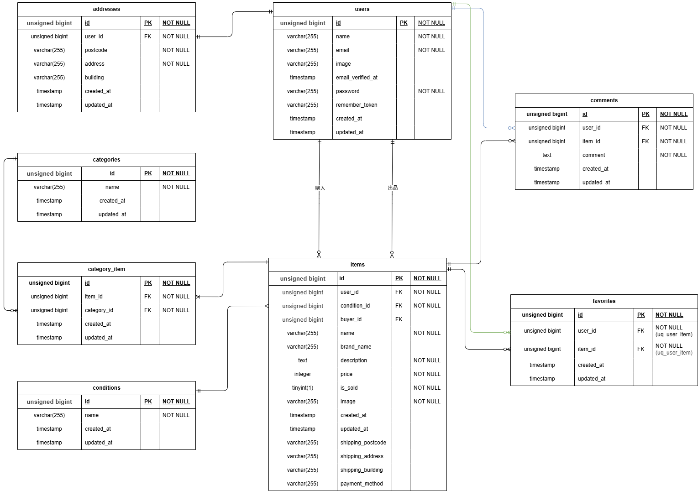

# coachtech フリマ

## 環境構築

**Dockerビルド**

- git clone git@github.com:mako236630/coachtech-flea-market.git
- cd coachtech-flea-market 
- docker-compose up -d --build

**laravel 環境構築**

- docker-compose exec php bash
- composer install
- cp .env.example .env  
.envは、docker-compose.ymlの定義に合わせて修正してください。
- php artisan key:generate
- php artisan migrate
- php artisan db:seed

## 開発環境

- 商品一覧画面: http://localhost/
- ログイン画面: http://localhost/login  
アプリの機能確認には、以下のテストアカウントをご利用ください。  
メールアドレス: test2@example.com  
パスワード: password789

- 会員登録画面: http://localhost/register
- phpMyAdmin: http://localhost:8080/

## 使用技術
- nginx 1.21.1
- php 8.1.34
- laravel 8.83.8
-MySQL 8.0.26

## ER図  
